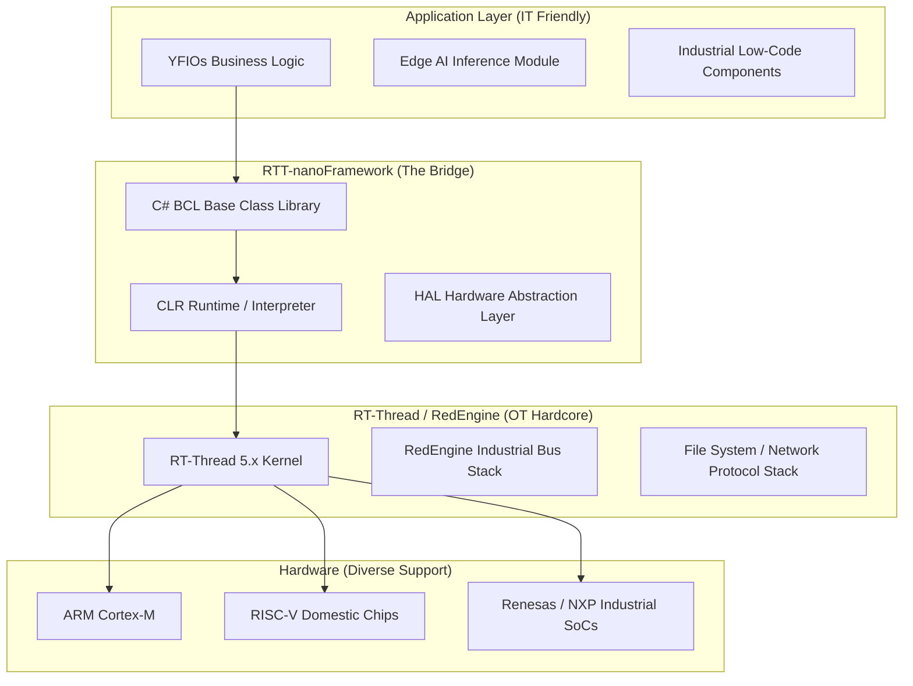

# RTT-nanoFramework
> **Power Industrial Hardware with C#: A .NET High-Level Language Real-Time Runtime Based on RT-Thread RedEngine Ecosystem**

[](LICENSE)
[](https://www.rt-thread.org/)
[](https://www.nanoframework.net/)
[](#)
[](#)

---

## 🌟 Project Background: Bridging the IT-OT Divide
In 2026, China's manufacturing industry is undergoing profound digital transformation. As talent from the internet industry migrates to manufacturing, enterprises face a critical challenge: **top software engineers are proficient in high-level languages (C#/Java), but intimidated by complex embedded C language and low-level registers.**

**RTT-nanoFramework** was built to address this gap. Leveraging over a decade of industrial control expertise from **YF IoT Technology**, we deeply ported the .NET Foundation-hosted **.NET nanoFramework** to the domestically independent **RT-Thread** real-time operating system (and RedEngine platform).

**Our Mission:** Deliver a foundational stack for Industry 4.0 that combines IT-level development efficiency with OT-level real-time stability.

---

## ✨ Core Features

### 1. Ultimate Productivity Toolchain
* **Visual Studio Integration:** Supports breakpoint debugging, variable monitoring, and instant hot deployment. Say goodbye to tedious serial print debugging—develop embedded logic just like desktop software.
* **Modern C# Syntax:** Full support for `async/await` asynchronous programming, type safety, and a robust class library ecosystem.

### 2. Deep Integration with RedEngine Industrial Platform
* **Native Bus Support:** Call RedEngine's built-in industrial protocol stacks (**EtherCAT**, **CANopen**, **Modbus TCP/RTU**) directly via C#.
* **Microsecond-Level Response:** Optimized managed code engine—critical tasks are mounted directly to RT-Thread hard real-time threads, meeting precision manufacturing requirements.

### 3. Edge AI & Data Processing
* **On-Premises Data Retention:** Built-in lightweight inference engine enables edge-side vibration analysis and anomaly prediction (no data leaving the factory).
* **SQL Storage Support:** Natively integrates lightweight databases like SQLite to meet on-site industrial data retention needs.

### 4. Enterprise-Grade Compliance & Reliability
* **Business-Friendly License:** Open-sourced under the **MIT License**—fully independent and controllable, with no "viral" risks associated with GPL.
* **Memory Safety:** Managed stack and garbage collection (GC) eliminate over 90% of system crash risks (e.g., memory leaks, wild pointers) at the physical layer.

---

## 🏗️ Technical Architecture


---

## 🎯 Industrial Use Cases

### Use Case A: Steel Mill Production Line Monitoring
* **Pain Point:** Complex on-site environments require rapid algorithm iteration for strip steel defect detection.
* **Solution:** Deploy RTT-nanoFramework-based gateways—software engineers can hot-deploy and debug C# code remotely from the office via network.

### Use Case B: Smart Energy Edge Gateway
* **Pain Point:** Data must be retained on-premises, and the system needs to interface with multiple meter protocols.
* **Solution:** Leverage RTT-nanoFramework's robust protocol parsing library to integrate 50+ device protocols across the entire plant in just one week.

---

## 🚀 Quick Start

### Step 1: Prepare the Firmware
Download the RT-Thread firmware for your board (e.g., STM32F4/H7, ESP32, RISC-V) from the [Releases](https://www.google.com/search?q=%23) page.

### Step 2: Install the Visual Studio Extension
Search for and install the **".NET nanoFramework Extension"** in Visual Studio's Extension Manager.

### Step 3: Write Your First Industrial Program
```csharp
using System;
using System.Device.Gpio;
using System.Threading;

// Simulate industrial on-site alarm logic
public class Program
{
    public static void Main()
    {
        var controller = new GpioController();
        // Assume Pin 10 is connected to an industrial warning light
        var alarmPin = controller.OpenPin(10, PinMode.Output);

        Console.WriteLine("RTT-nanoFramework Industrial System is Ready!");

        while (true)
        {
            alarmPin.Write(PinValue.High);
            Thread.Sleep(500);
            alarmPin.Write(PinValue.Low);
            Thread.Sleep(500);
        }
    }
}
```

---

## 🗓️ 2026 Roadmap

* [x] **2026 Q1:** Complete CLR core porting based on RT-Thread 5.x.
* [x] **2026 Q2:** Finish driver binding for basic peripherals (GPIO, UART, I2C).
* [ ] **2026 Q3:** Release **RedEngine Exclusive Package**: Deep integration with EtherCAT and high-performance CAN drivers.


---

## 🤝 Contributors & Acknowledgments

* **[nanoFramework Team](https://github.com/nanoframework):** Gratitude to José Simões and his Portuguese development team for their pioneering work.
* **[RT-Thread Official](https://github.com/RT-Thread/rt-thread):** Thanks to the RT-Thread team for the powerful real-time kernel and RedEngine industrial ecosystem.
* **[YF IoT Technology](http://www.yfiot.com):** Acknowledgment of the company's 10+ years of persistent pursuit of .NET miniaturization technology.

---

## 📄 Open Source License
This project is licensed under the **MIT License**. You may safely include this component in your commercial products without disclosing your core business code.

---

**⭐ Star Us If You Find This Useful!**  
For technical questions or business cooperation, reach out via GitHub Issues or email [lhf@yfiot.com].