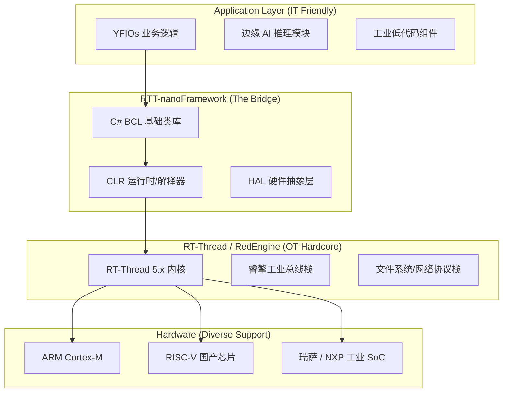

# RTT-nanoFramework

[English](README.en.md) | **中文** 

> **让 C# 驱动工业硬核：基于 RT-Thread 睿擎生态的 .NET 高级语言实时运行环境**

[](LICENSE)
[](https://www.rt-thread.org/)
[](https://www.nanoframework.net/)
[](#)
[](#)

---

## 🌟 项目背景：跨越 IT 与 OT 的鸿沟

进入 2026 年，中国制造业正经历深刻的数字化转型。随着互联网行业的人才向制造业迁徙，一个严峻的问题摆在企业面前：**优秀的软件工程师熟悉高级语言（C#/Java），却对复杂的嵌入式 C 语言和底层寄存器望而生畏。**

**RTT-nanoFramework** 正是为此而生。我们基于 **叶帆科技** 十余年在工控领域的深厚积累，将受 .NET 基金会托管的 **.NET nanoFramework** 深度移植至国产自主的 **RT-Thread** 实时操作系统（及睿擎 RedEngine 平台）。

**我们的使命：** 为工业 4.0 提供一套既具备 IT 开发效率，又具备 OT 实时稳定性的底层底座。

---

## ✨ 核心特性

### 1. 极致的生产力工具链
* **Visual Studio 集成：** 支持断点调试、变量监控、即时热更新。告别繁琐的串口打印调试，像写上位机软件一样写嵌入式逻辑。
* **C# 现代语法：** 完整支持 `async/await` 异步编程、类型安全、以及强大的类库。

### 2. 深度适配“睿擎”工业平台
* **原生总线支持：** 通过 C# 即可调用睿擎内置的 **EtherCAT**、**CANopen**、**Modbus TCP/RTU** 工业协议栈。
* **微秒级响应：** 托管代码引擎经过优化，关键任务直接挂载 RT-Thread 硬实时线程，满足精密制造需求。

### 3. 边缘 AI 与数据处理
* **数据不出厂：** 依托内置的轻量化推理引擎，支持在边缘侧直接进行振动分析、异常预测。
* **SQL 存储支持：** 内置对 SQLite 等轻量化数据库的支持，满足工业现场数据本地留存的需求。

### 4. 企业级合规保障
* **商业友好协议：** 采用 **MIT** 协议开源，完全自主可控，无 GPL 协议的“传染”风险。
* **内存安全：** 依靠托管堆栈与垃圾回收（GC），从物理层规避了 90% 以上的系统崩溃隐患（如内存泄漏、野指针）。

---

## 🏗️ 技术架构


---

## 🎯 工业场景实战

### 案例 A：钢铁厂产线监控

* **痛点：** 现场环境复杂，需要快速迭代算法以识别带钢缺陷。
* **方案：** 部署基于 RTT-nanoFramework 的网关，软件工程师在办公室通过网络即可进行 Chttps://www.google.com/search?q=%23 代码的热部署与调试。

### 案例 B：智慧能源边缘网关

* **痛点：** 数据需要留存在企业内部，且需要对接多种不同协议的电表。
* **方案：** 利用 RTT-nanoFramework 强大的协议解析库，一周内完成全厂 50 余种设备的协议接入。

---

## 🚀 快速上手 (Quick Start)

### 第一步：准备固件

从 [Releases](https://www.google.com/search?q=%23) 页面下载对应您板卡（如 STM32F4/H7, ESP32, RISC-V）的 RT-Thread 固件。

### 第二步：安装 Visual Studio 扩展

在 Visual Studio 的扩展管理中搜索并安装 **".NET nanoFramework Extension"**。

### 第三步：编写您的首个工业程序

```csharp
using System;
using System.Device.Gpio;
using System.Threading;

// 模拟工业现场报警逻辑
public class Program
{
    public static void Main()
    {
        var controller = new GpioController();
        // 假设 Pin 10 连接着工业警示灯
        var alarmPin = controller.OpenPin(10, PinMode.Output);

        Console.WriteLine("RTT-nanoFramework 工业系统已就绪！");

        while (true)
        {
            alarmPin.Write(PinValue.High);
            Thread.Sleep(500);
            alarmPin.Write(PinValue.Low);
            Thread.Sleep(500);
        }
    }
}

```

---

## 🗓️ 2026 路线图 (Roadmap)

* [x] **2026 Q1:** 实现基于 RT-Thread 5.x 的 CLR 核心移植。
* [x] **2026 Q2:** 完成 GPIO、UART、I2C 等基础外设驱动绑定。
* [ ] **2026 Q3:** 发布 **睿擎专用包**：深度集成 EtherCAT 与高性能 CAN 驱动。


---

## 🤝 贡献者与技术致谢

* **[nanoFramework 团队](https://github.com/nanoframework):** 感谢 José Simões 及其葡萄牙开发团队开创性的工作。
* **[RT-Thread 官方](https://github.com/RT-Thread/rt-thread):** 感谢睿赛德团队提供的强大实时内核与睿擎工业生态。
* **[叶帆科技](http://www.yfiot.com):** 感谢公司过去 十余年对 .NET 微型化技术的不懈追求。

---

## 📄 开源协议

本项目采用 **MIT License**。您可以放心在您的商业产品中包含本组件，无需公开您的核心业务代码。

---

**⭐ 欢迎 Star 我们！** > 任何技术问题或商业合作，请通过 GitHub Issue 或发送邮件至 [lhf@yfiot.com] 与我们联系。

